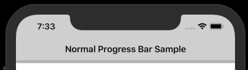

# Progress Bar
A really normal progress bar that function like a normal progress bar. A progress bar which can perform determinate progress and indeterminate progress.

[](https://www.nuget.org/packages/iNormal.ProgressBar/)

## Indeterminate Progress
```C#
var progressBar = new ProgressBar();
progressBar.IsIndeterminate = true;
```


## Determinate Progress
```C#
var progressBar = new ProgressBar();
progressBar.Progress = 0.5f;
```
or
```C#
var progressBar = new ProgressBar();
progressBar.Value = 50;
progressBar.Max = 100;
```


